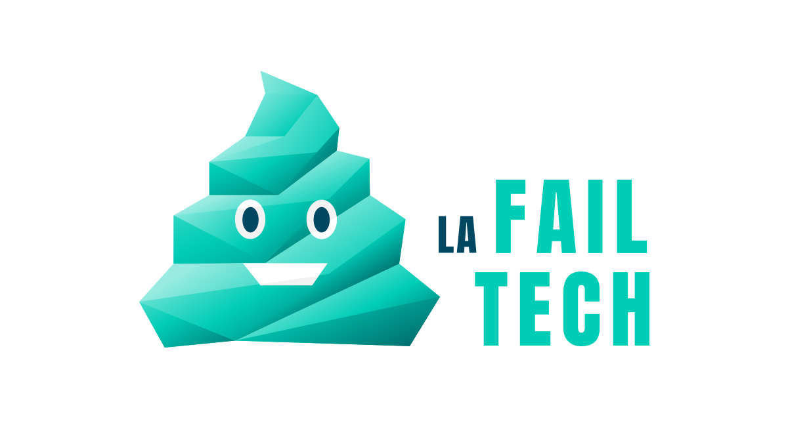

# Naddymess

A French satirical website about startups.

## How to build the project

### Requirements

- Ruby + Bundle
- Node.js + npm

### Building

- `npm install`
- `bundle install`
- fetch content from Contentful (see the following section)
- build (for prod): `npm run build && bundle exec jekyll build -t`
- watch (for dev):
  - `npm run watch`
  - `bundle exec jekyll build -t -w` (in another terminal)

### How to fetch content from Contentful

See [contentful2md](https://github.com/dsferruzza/contentful2md).

## How to deploy the project

- go to the GitLab project page
- CI/CD > Pipelines
- click on `Run Pipeline` (create for `master`, which is the default value)
- wait a few minutes
- if the website site looks good on preproduction, run the manual job in the pipeline page to deploy it to production

## License

This repository is under the [Apache 2.0 license](LICENSE), with the exception of the following contents:

- the [Milo theme](https://themes.getbootstrap.com/product/milo-magazineblog-theme/) located in the `src/_scss/milo/` directory is under a proprietary license
- articles (text and images) readable on [the website](https://www.naddymess.fr) are not included in the repository and belong to their respective authors and [Startup Palace](https://www.startup-palace.com/)

---

)
